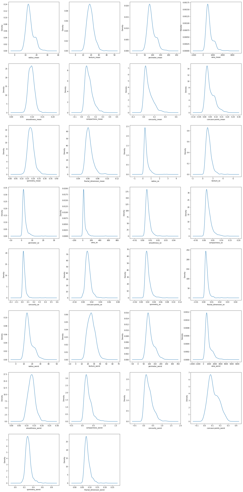

# Wisconsin_Breast_Cancer

It appears that XGBClassifier is the best model choice at 95.614% accuracy rate.  Using this model, we are able to predict a diagnsis of malignancy.

The plots below are showing the distribtution of the data over a continuous interval.

